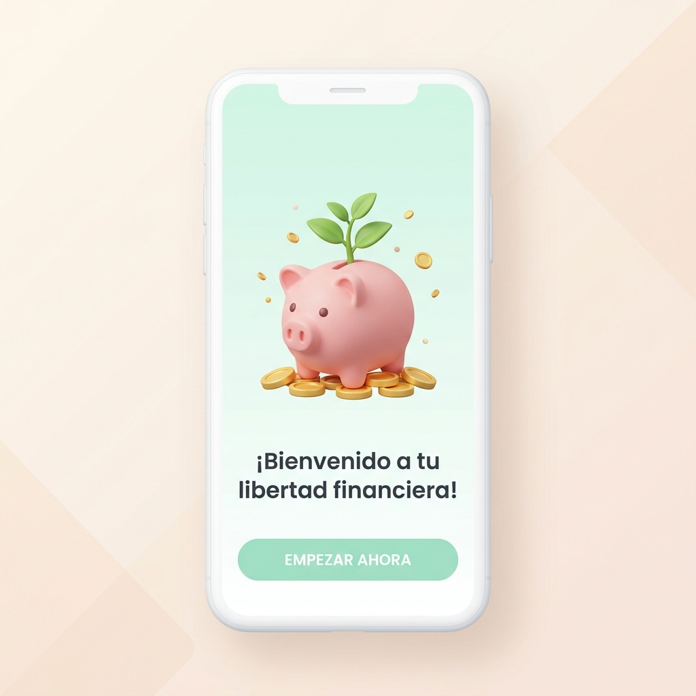
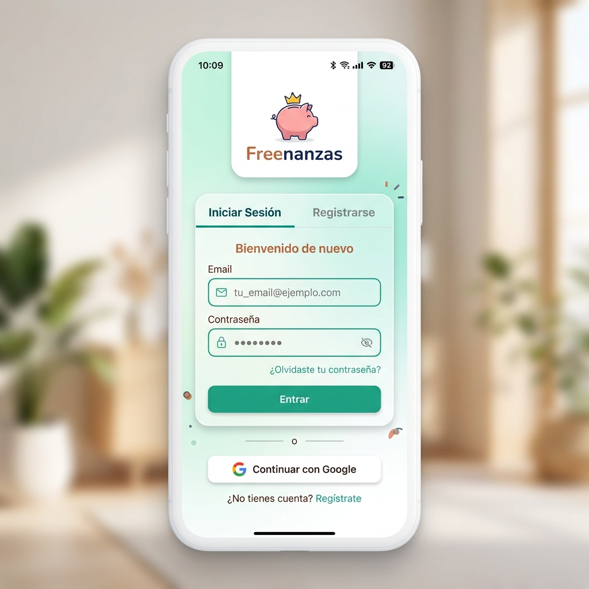
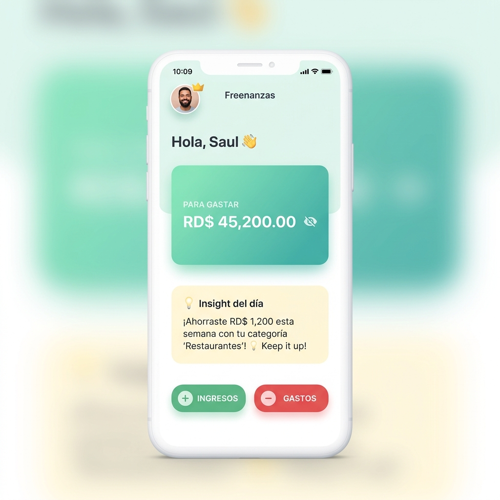
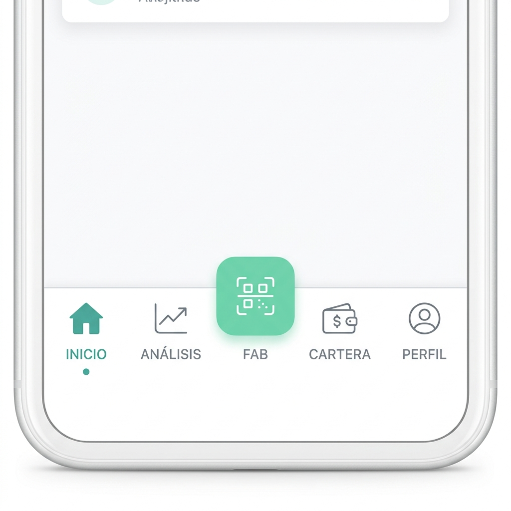
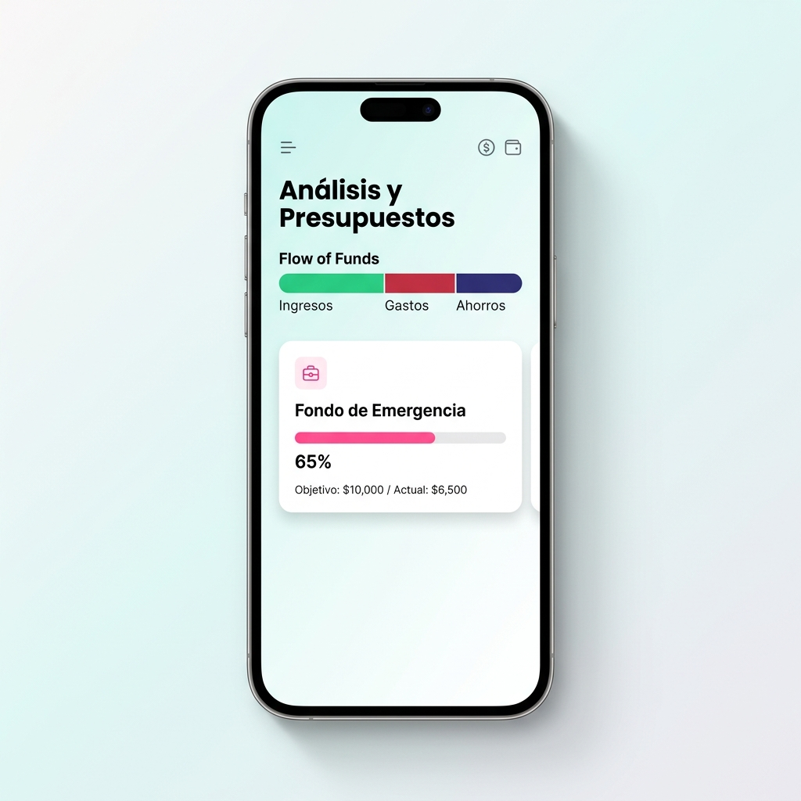
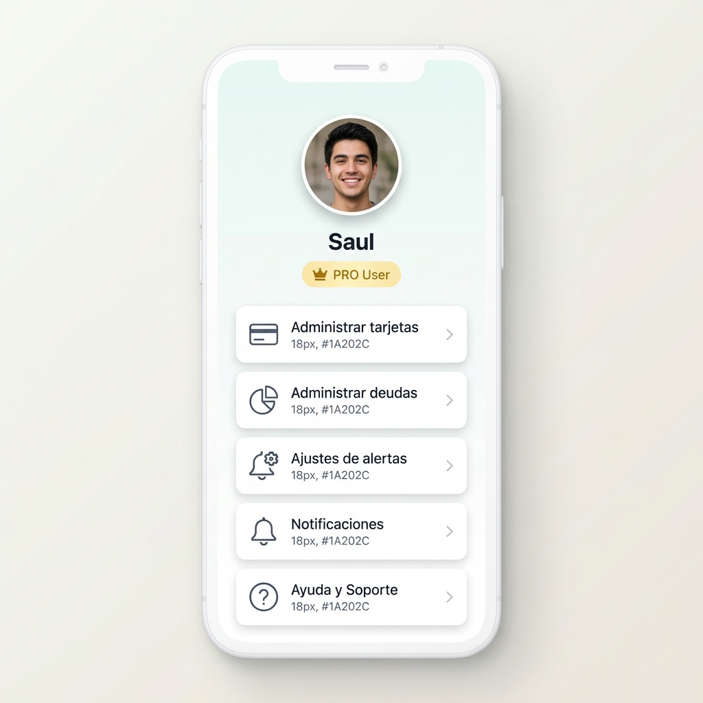

# Guía de Usuario - Freenanzas APP
*Aprende a usar cada función paso a paso para alcanzar tu libertad financiera.*

---

## 1. Portada

  
  
  # Freenanzas APP
  ### Guía de Usuario Oficial
  **Versión:** 1.0 (Junio 2026)  
  **Localización:** República Dominicana (RD$)  
  *Una app amigable que te ayuda a entender y gestionar mejor tus finanzas.*

---

## 2. Bienvenida

¡Hola! Te damos la más cálida bienvenida a **Freenanzas APP**, tu nuevo compañero de camino hacia el bienestar financiero. Sabemos que hablar de dinero a veces puede parecer complicado, frío o aburrido. Por eso hemos diseñado una aplicación **amigable, simple y optimista** que te ayuda a tomar el control de tus finanzas sin estrés.

### ¿Qué es Freenanzas APP?
Es una billetera digital y planificador financiero inteligente estructurado bajo principios de **economía conductual** y apoyado por **Inteligencia Artificial (IA)**. Su objetivo principal es ayudarte a entender en qué se va tu dinero y guiarte a tomar mejores decisiones de consumo en tu día a día, usando tu moneda local (RD$).

### ¿Cómo te ayuda en tu día a día?
- **Claridad instantánea:** Sabrás exactamente cuánto dinero tienes disponible para gastar en el mes, descontando tus compromisos y ahorros.
- **Toma de decisiones inteligente:** Podrás consultar con nuestro **Filtro IA** antes de realizar una compra impulsiva para saber si realmente te conviene.
- **Automatización de registro:** Olvídate de digitar facturas largas; solo tómale una foto a tus recibos y la IA completará los datos por ti.
- **Consejos personalizados:** Recibe un "Insight del día" adaptado a tu comportamiento financiero para motivarte a seguir mejorando.

---

## 3. Instalación y Acceso

Para comenzar tu viaje en Freenanzas, sigue estos sencillos pasos para configurar tu cuenta de manera rápida y segura.

### Pasos para registrarte e iniciar sesión
1. **Abre la aplicación:** Al ingresar por primera vez, verás tres pantallas de bienvenida (onboarding) que te guiarán sobre los pilares de la app: libertad financiera, presupuestos inteligentes y metas de ahorro reales.
2. **Elige tu método de ingreso:** 
   - **Google Sign-In (Recomendado):** Pulsa el botón "Continuar con Google" para acceder de inmediato con tu cuenta de Google.
   - **Registro por correo electrónico:** Selecciona la pestaña **Registrarse**, escribe tu nombre completo, correo electrónico y crea una contraseña segura (mínimo 6 caracteres).
3. **Inicio de sesión:** Si ya tienes una cuenta, mantente en la pestaña **Iniciar Sesión**, introduce tus credenciales y pulsa **Entrar**.
4. **Permisos de cámara:** Al ingresar, la aplicación te solicitará permisos para acceder a la cámara. Esto es indispensable si deseas escanear facturas y recibos físicos mediante nuestra IA.

  
  
<em>Figura 1: Pantalla de inicio de sesión y registro rápido de Freenanzas.</em>

> [!NOTE]
> **Recuperación de Contraseña:** Si olvidas tus datos de acceso, en la pantalla de Iniciar Sesión verás la opción "¿Olvidaste tu contraseña?". Al hacer clic, recibirás un correo de restablecimiento seguro.

---

## 4. Pantalla Principal (Dashboard)

El Dashboard es tu centro de control financiero. Ha sido diseñado para que de un solo vistazo comprendas el estado de tu bolsillo sin abrumarte con gráficos complejos.

  
  
<em>Figura 2: Dashboard principal con saldos y accesos directos.</em>

### Elementos clave de la pantalla principal

| Elemento | Función / Descripción |
| :--- | :--- |
| **Saludo Inicial** | Muestra tu nombre con el que te registraste. Si eres usuario **PRO**, verás un icono de corona dorada (👑). |
| **Pestañas de Balance** | Alterna entre la pestaña **Para Gastar** (saldo libre de compromisos) y **Mis Ahorros** (tu fondo protegido). |
| **Ocultar Saldos (👁️)** | Un botón de ojo junto al monto que te permite esconder los números para mayor privacidad en lugares públicos. |
| **Insight del Día** | Una caja informativa de color amarillo donde la IA analiza tus gastos de la semana y te da un consejo práctico o felicitación. |
| **Botones de Acción Rápida** | Los botones **Ingresos (+)** y **Gastos (-)** en la parte inferior de la pantalla para registrar transacciones manualmente. |

---

## 5. Menú de Navegación

Freenanzas cuenta con un dock de navegación inferior para moverte fácilmente entre los módulos principales de la aplicación.

  
  
<em>Figura 3: Barra de navegación inferior con acceso rápido al Escáner FAB.</em>

### Funciones del menú inferior

1. **INICIO:** Te lleva de regreso al Dashboard principal con tus saldos actualizados.
2. **ANÁLISIS:** Te muestra las estadísticas del mes, el balance acumulado y el progreso de tus presupuestos y metas.
3. **ESCÁNER FAB (Botón flotante central 📷):** Un botón verde destacado con el icono de escáner. Al pulsarlo, se abre directamente la cámara para capturar facturas físicas con IA de forma inmediata.
4. **CARTERA:** El historial de todas tus transacciones. Puedes filtrar tus movimientos por fecha, categoría o monto.
5. **PERFIL:** Permite configurar tus cuentas, gestionar deudas, tarjetas vinculadas, configurar recordatorios y acceder al soporte técnico.

---

## 6. Funciones Principales (Paso a Paso)

### 6.1. Registro de Ingresos y Gastos (Escaneo con IA)
Puedes registrar tus movimientos financieros de dos maneras: manual o escaneo inteligente.

#### Registro Manual:
1. Pulsa **Gastos** o **Ingresos** en el Dashboard, o haz clic en el botón central de escáner.
2. Escribe el monto en pesos dominicanos (RD$).
3. Selecciona la **Categoría** correspondiente (Comida, Transporte, Renta, Servicios, Ocio, Salud, etc.).
4. Elige la fecha (por defecto es hoy) y añade una nota opcional si quieres recordar un detalle específico.
5. Si pagaste con tarjeta de crédito, activa la opción **¿Pago con Tarjeta?** y selecciona la tarjeta correspondiente para restar de tu límite disponible.
6. Pulsa **Guardar**.

#### Escaneo con IA (Exclusivo PRO):
1. Pulsa el botón flotante central de la cámara.
2. Enfoca bien tu factura o recibo físico y toma la foto.
3. Nuestra IA procesará la imagen en segundos para:
   - Extraer el monto exacto del ticket.
   - Detectar la fecha y hora del gasto.
   - Sugerir la categoría más adecuada automáticamente.
   - Completar campos avanzados como el RNC del comercio, nombre del establecimiento y número de ticket.
4. Revisa los datos y pulsa **Guardar**.

  
  
<em>Figura 4: Formulario de adición de transacciones con opción de escáner de facturas por IA.</em>

> [!WARNING]
> **Alerta de Duplicados:** Si intentas escanear o registrar un gasto que tenga el mismo monto y fecha que uno ya registrado en las últimas 24 horas, la app te mostrará una alerta para evitar registros dobles.

---

### 6.2. Filtro IA Preventivo (El freno a las compras impulsivas)
¿Estás a punto de comprar algo de lo que podrías arrepentirte? El **Filtro IA** está basado en economía conductual para ayudarte a evaluar compras antes de gastar el dinero.

1. Navega a **Filtro IA** (o pulsa la opción en la sección de Herramientas Financieras del Dashboard).
2. Ingresa el nombre del artículo (ej. *"Tenis deportivos"*) y su precio (ej. *"RD$ 5,800"*).
3. Selecciona tu **Nivel de Tentación** en una barra del 1 al 10 (donde 10 es "Lo quiero ya mismo").
4. La IA analizará tu presupuesto disponible, tus deudas pendientes de tarjetas de crédito y tu meta de ahorro mensual actual.
5. El sistema te dará una recomendación honesta y amigable:
   - 🟢 **Adelante:** Si está dentro de tu presupuesto y no interfiere con tus metas.
   - 🟡 **Piénsalo dos veces:** Si es un capricho que afectará de forma leve tus ahorros.
   - 🔴 **Alerta Impulsiva:** Si la compra compromete el pago de tus servicios fijos o deudas inmediatas.

  
  
<em>Figura 5: Filtro IA preventivo analizando una posible compra impulsiva.</em>

---

### 6.3. Análisis de Presupuesto y Progreso de Metas
Esta pantalla te ayuda a visualizar cómo se distribuye tu dinero usando la regla **50/30/20** (50% Necesidades, 30% Deseos, 20% Ahorros).

#### ¿Cómo configurar tu presupuesto mensual?
1. Ve a la sección **Análisis** en el menú inferior.
2. Configura tu presupuesto global del mes (ej. *"RD$ 50,000"*).
3. Distribuye tus límites por categorías.
4. Visualiza la barra de color del flujo de caja:
   - **Verde (Ingresos):** Dinero total que ha entrado.
   - **Rojo (Gastos):** Dinero que ya has consumido.
   - **Indigo (Ahorros):** Dinero protegido y enviado a tus metas.

#### Creación de Metas de Ahorro:
1. Dentro de la sección de presupuestos, selecciona **Crear Meta**.
2. Ponle un nombre motivador (ej. *"Fondo de Emergencia"*, *"Viaje a la playa"*, o *"Comprar mi Laptop"*).
3. Establece la cantidad meta en RD$ y el plazo.
4. La aplicación te dirá cuánto debes separar automáticamente cada mes de tus ingresos. A medida que registres transacciones bajo la categoría "Ahorro", verás el progreso porcentual con animaciones.

  
  
<em>Figura 6: Visualización de presupuestos mensuales y metas de ahorro activas.</em>

---

### 6.4. Perfil y Ajustes Financieros
En tu perfil puedes personalizar la app y llevar el control de tus herramientas de crédito.

1. Ve a **Perfil** en el menú inferior.
2. Si eres usuario **PRO**, verás la insignia dorada que te acredita como miembro premium de Freenanzas.
3. Encontrarás las siguientes opciones:
   - **Administrar tarjetas:** Configura tus tarjetas de crédito asociadas, su fecha de corte y límite para recibir alertas de pago antes del vencimiento.
   - **Administrar deudas:** Registra tus préstamos personales o bancarios para calcular tu tasa de endeudamiento general.
   - **Ajustes de alertas:** Configura notificaciones push y recordatorios diarios para registrar tus gastos.
   - **Ayuda y Soporte:** Envío de reportes de errores o sugerencias al equipo de desarrollo.

  
  
<em>Figura 7: Menú de ajustes del perfil de usuario y configuración PRO.</em>

---

## 7. Consejos de Uso y Economía Conductual

Para sacarle el mayor provecho a Freenanzas APP, te recomendamos adoptar estas buenas prácticas financieras:

- **Registra al instante:** No dejes pasar el día para registrar tus gastos pequeños. Esos "gastos hormiga" (como el café de la tarde o propinas) son los que más afectan tu presupuesto sin que te des cuenta.
- **Usa el Filtro IA antes de pasar la tarjeta:** Haz del Filtro IA un hábito. Si sientes la tentación de comprar algo en línea o en una tienda física, tómate 1 minuto para consultarlo con la IA. Esa pequeña pausa psicológica reduce las compras por impulso en más de un 40%.
- **Respeta la Pestaña "Para Gastar":** Trata ese número como tu saldo real de cuenta. El dinero en "Mis Ahorros" está bloqueado psicológicamente para que no cuentes con él para tus consumos diarios.
- **Mantén tu Alerta de Tarjetas de Crédito Activa:** Vincula tus fechas de corte. Pagar a tiempo tu tarjeta te ahorrará cargos por financiamiento y mora que pueden desestabilizar tu mes.

---

## 8. Preguntas Frecuentes (FAQ)

Aquí tienes respuestas rápidas a las dudas más comunes que surgen al utilizar la aplicación.

| Problema / Duda | Causa Posible | Solución Sugerida |
| :--- | :--- | :--- |
| **No puedo iniciar sesión con mi correo** | Escribiste mal el correo o la contraseña es incorrecta. | Pulsa "¿Olvidaste tu contraseña?" para recibir un enlace de reinicio en tu correo. |
| **El escáner de facturas da error** | La foto está borrosa, tiene mala iluminación o la cámara no enfocó. | Toma la foto desde arriba, en un lugar bien iluminado, asegurándote de que el monto total de la factura sea completamente legible. |
| **¿Mis datos bancarios están seguros?** | Freenanzas no se conecta directamente a tus cuentas bancarias. | Todos los registros se hacen de forma manual o escaneando comprobantes de compra. Tus datos están guardados de forma segura en bases de datos en la nube con cifrado SSL. |
| **La app me sale bloqueada con candados** | Tu período de prueba gratuita (Trial) de Freenanzas PRO ha vencido. | Puedes continuar usando las funciones básicas o adquirir la suscripción mensual/anual PRO en la sección de Perfil. |

---

## 9. Soporte y Contacto

Si tienes alguna pregunta adicional, encuentras un error o quieres enviarnos alguna sugerencia para mejorar la aplicación, no dudes en escribirnos:

- **Correo de Soporte:** [soporte@freenanzas.com](mailto:soporte@freenanzas.com)
- **Horario de Atención:** Lunes a Viernes de 8:00 AM a 6:00 PM (Hora de República Dominicana)
- **¿Qué información enviar?:** Para ayudarte más rápido, por favor indícanos:
  1. Tu nombre de usuario y correo registrado.
  2. Una descripción breve del problema o la duda.
  3. Si es un error visual o de funcionamiento, adjunta una captura de pantalla.

---

*¡Gracias por confiar en Freenanzas APP para construir tu libertad financiera paso a paso!* 🐷🌱✨
