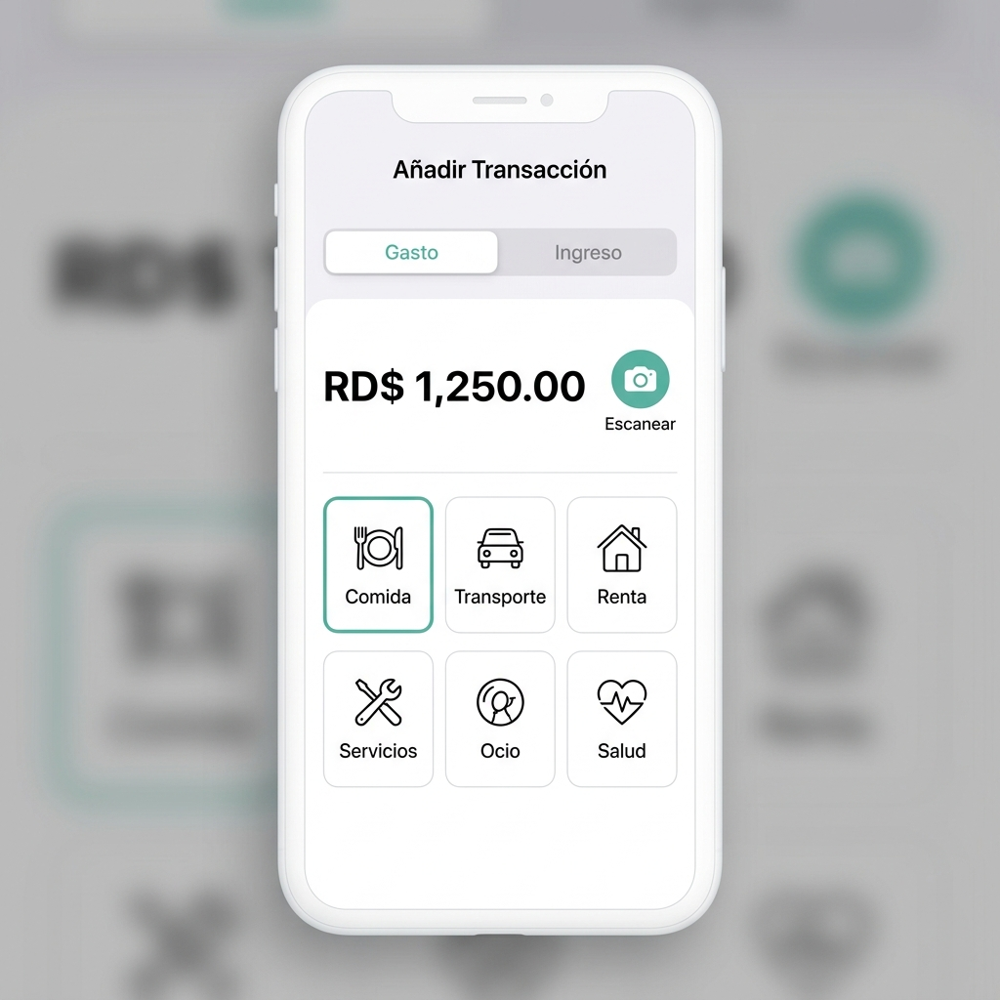
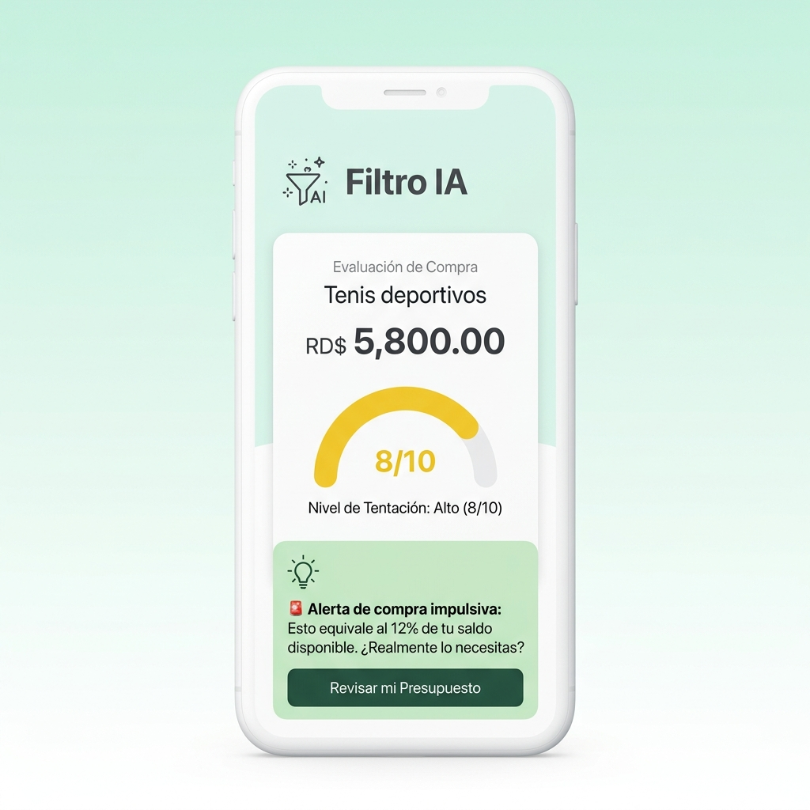

# Manual de Usuario - Freenanzas APP
*Aprende a gestionar tus finanzas personales y alcanzar tu libertad financiera paso a paso.*

---

## Freenanzas APP
**Versión:** 1.0 (Junio 2026)  
**Localización:** República Dominicana (RD$)  
**Línea Gráfica:** Menta/Teal/Rosado (Línea Gráfica 3D Suave)  
**Contacto de Soporte:** saul640@gmail.com  

---

## Índice
1. [Introducción](#1-introducción)
2. [Requisitos para usar la aplicación](#2-requisitos-para-usar-la-aplicación)
3. [Primer acceso](#3-primer-acceso)
4. [Inicio de sesión y registro](#4-inicio-de-sesión-y-registro)
5. [Pantalla principal](#5-pantalla-principal)
6. [Navegación general](#6-navegación-general)
7. [Funcionalidades principales](#7-funcionalidades-principales)
8. [Flujos paso a paso](#8-flujos-paso-a-paso)
9. [Configuración del usuario](#9-configuración-del-usuario)
10. [Preguntas frecuentes](#10-preguntas-frecuentes)
11. [Solución de problemas](#11-solución-de-problemas)
12. [Glosario](#12-glosario)
13. [Soporte](#13-soporte)
14. [Anexos](#14-anexos)

---

## 1. Introducción

¡Bienvenido a **Freenanzas APP**! 

Freenanzas es una billetera digital y planificador financiero inteligente diseñado bajo principios de **economía conductual** y apoyado por **Inteligencia Artificial (IA)**. 

### ¿Qué problema resuelve?
El descontrol de los gastos del día a día, la falta de visibilidad del dinero disponible y la impulsividad al comprar. Freenanzas no es una hoja de cálculo fría y aburrida; es una herramienta interactiva, visual y amigable que te enseña a gastar con intención.

### Beneficios clave:
* **Freno a las compras impulsivas:** Evalúa si realmente necesitas un producto antes de pagarlo gracias a nuestro Filtro IA.
* **Cero digitación aburrida:** Escanea tus facturas con la cámara y deja que la IA autocomplete todo por ti.
* **Dinero "Para Gastar" real:** Visualiza solo el dinero que tienes libre, protegiendo automáticamente tus ahorros y tus gastos fijos del mes.
* **Acompañamiento inteligente:** Recibe sugerencias personalizadas de tu asesor financiero IA según tus patrones de consumo.

---

## 2. Requisitos para usar la aplicación

Para que la aplicación funcione de manera óptima, tu dispositivo debe cumplir con lo siguiente:
* **Dispositivo:** Teléfono inteligente o tableta con cámara integrada (iOS o Android), o computadora personal.
* **Navegador:** Versión actualizada de Google Chrome, Safari, Firefox o Microsoft Edge.
* **Conexión a Internet:** Conexión activa (móvil o Wi-Fi) para sincronizar con la base de datos de Firebase y procesar consultas de IA.
* **Permisos del sistema:** Acceso a la cámara del dispositivo (requerido únicamente para el escaneo automático de facturas).

---

## 3. Primer acceso

Al abrir Freenanzas por primera vez en tu dispositivo, serás recibido por un **flujo de onboarding** interactivo de tres pantallas que te introduce a las bases del bienestar financiero:
1. **Libertad Financiera:** Aprende a separar tu ahorro desde el primer día.
2. **Presupuestos Inteligentes:** Controla tus límites según la regla 50/30/20.
3. **Metas de Ahorro:** Define propósitos claros y hazles seguimiento.

---

## 4. Inicio de sesión y registro

Una vez pases el onboarding, accederás a la pantalla de ingreso. Tienes dos métodos disponibles:

### A. Acceso rápido con Google (Recomendado)
1. Presiona el botón **"Continuar con Google"**.
2. Selecciona tu cuenta de Google y dale acceso. El sistema creará tu perfil automáticamente sin necesidad de contraseñas.

### B. Registro con Correo Electrónico
1. Selecciona la pestaña **"Registrarse"**.
2. Completa los campos: Nombre Completo, Correo Electrónico y crea una Contraseña de mínimo 6 caracteres.
3. Presiona **"Registrarme"**. Recibirás un enlace en tu correo para verificar tu cuenta.

### C. Restablecer Contraseña
Si ya estás registrado pero no recuerdas tu clave:
1. En la pestaña "Iniciar Sesión", presiona **"¿Olvidaste tu contraseña?"**.
2. Escribe tu correo electrónico y haz clic en enviar. Te llegará un correo de restablecimiento seguro al instante.

---

## 5. Pantalla principal

El Dashboard o pantalla principal de Freenanzas ha sido diseñado para mostrarte el estado de tu bolsillo sin abrumarte:

* **Saldos tricolores:**
  * **Para Gastar:** El saldo real que tienes libre una vez descontados tus gastos recurrentes y ahorros.
  * **Mis Ahorros:** El fondo que has separado de forma segura y que está protegido de tentaciones cotidianas.
* **Ocultar Saldo (👁️):** Un botón al lado de la cifra que te permite enmascarar los montos en lugares públicos para proteger tu privacidad.
* **Insight del Día:** Un recuadro destacado donde la IA analiza tus movimientos recientes y te da un consejo conductual práctico.
* **Botones Rápidos (+ y -):** Botones flotantes de acceso inmediato para registrar ingresos (+) o gastos (-) manualmente.

---

## 6. Navegación general

Para moverte entre las diferentes secciones de Freenanzas, utiliza el dock de navegación redondeado situado en la parte inferior de la pantalla:

| Icono | Sección | Descripción y Uso Principal |
| :---: | :---: | :--- |
| **home** | **INICIO** | Regresa al Dashboard de saldos principales y consejos diarios. |
| **pie_chart** | **ANÁLISIS** | Consulta gráficos del mes, flujos de caja y el progreso de metas. |
| **📷** | **ESCÁNER** | Botón flotante central de acceso directo a la cámara para facturas. |
| **account_balance** | **CARTERA** | Historial completo de movimientos, búsquedas y filtros detallados. |
| **person** | **PERFIL** | Acceso a administración de tarjetas, deudas, alertas y soporte. |

---

## 7. Funcionalidades principales

Freenanzas cuenta con herramientas avanzadas para optimizar tus finanzas:

### 7.1. Registro de Transacciones (Manual y con IA)
* **Escaneo con IA (Exclusivo PRO):** Toma una foto a tu factura física. La IA procesa la imagen y extrae el monto, nombre del comercio, RNC, fecha e incluso te categoriza el gasto en segundos.
* **Pre-validación de duplicados:** Si intentas subir una transacción idéntica a una guardada en las últimas 24 horas, la aplicación te detiene con un aviso para evitar dobles registros.

### 7.2. Filtro IA Preventivo
Es la herramienta estrella para frenar la impulsividad. Te pregunta qué quieres comprar, cuánto cuesta y tu nivel de tentación (1 al 10). La IA cruza esto con tus presupuestos y metas vigentes para darte una recomendación en color semáforo (Verde = Adelante, Amarillo = Piénsalo, Rojo = Detente).

### 7.3. Análisis de Presupuesto y Metas (Regla 50/30/20)
Configura tu presupuesto dividiéndolo de forma recomendada: 50% para Necesidades Básicas, 30% para Ocio/Deseos y 20% para Ahorro. Define metas específicas con fecha límite (por ejemplo, "Fondo de Emergencia" o "Laptop") y observa el avance en una barra dinámica.

### 7.4. Gestión de Tarjetas de Crédito
Vincula tus tarjetas plásticas ingresando su nombre, límite de crédito en pesos, fecha de corte y límite de pago. Cuando registres un gasto, activa la opción **"¿Pago con tarjeta?"** para que el monto se compute en tu saldo al corte y el límite disponible se actualice al instante.

### 7.5. Control de Préstamos y Deudas
Permite ingresar tus deudas activas indicando el saldo adeudado, tasa de interés anual (%) y cuota mensual. Freenanzas calcula tu nivel de endeudamiento global y te alerta en el dashboard si estás pagando intereses altos (más del 25% anual).

### 7.6. Gastos Recurrentes y Calendario
Automatiza el registro de tus servicios fijos (luz, agua, internet, renta) o suscripciones recurrentes (streaming). El sistema descuenta preventivamente este dinero del disponible "Para Gastar" para asegurar que tus compromisos siempre estén cubiertos.

### 7.7. Asesor Financiero IA
Un chat interactivo con un consultor financiero inteligente basado en Google Gemini. Puedes pedirle consejos o preguntarle cosas como: *"¿Cómo reduzco mis gastos de comida este mes?"*. Analizará de forma privada tus patrones reales y te dará una lista de tareas realizables.

---

## 8. Flujos paso a paso

### Flujo A: Registro e Inicio de Sesión
1. Abre la aplicación y lee las pantallas de bienvenida.
2. Pulsa en la pestaña **Registrarse** si es tu primera vez, o **Iniciar Sesión** si ya tienes una cuenta.
3. Escribe tu correo electrónico y tu contraseña de seguridad.
4. Presiona el botón verde de confirmación para entrar.

### Flujo B: Configuración del Presupuesto y Metas de Ahorro
1. En el menú inferior, selecciona la pestaña **ANÁLISIS** (icono de gráfico).
2. Haz clic en **Configurar Presupuesto**. Escribe tus ingresos mensuales estimados.
3. Selecciona la opción **Crear Meta de Ahorro**.
4. Escribe el nombre de tu meta (ej. *Fondo de Emergencia*), el monto objetivo (ej. *RD$ 20,000*) y el mes meta.
5. Presiona **Guardar**. La app te mostrará cuánto debes separar mensualmente.

### Flujo C: Registro de Gasto con Escaneo IA (PRO)
1. Presiona el botón flotante central de la **Cámara (📷)** en el dock inferior.
2. Otorga los permisos de cámara y toma una foto clara de tu recibo o factura de supermercado o combustible.
3. Espera 3 segundos mientras la IA procesa la imagen.
4. Revisa los datos extraídos (Monto, Comercio, RNC, Categoría). Modifica cualquier campo si es necesario.
5. Presiona **Guardar Transacción**. El gasto se registrará y se restará de tu saldo "Para Gastar" mensual.

### Flujo D: Consulta de Gasto con Filtro IA
1. En el Dashboard de inicio, haz clic en el botón **Filtro IA** (icono de candado o freno).
2. Escribe el artículo que deseas comprar (ej. *Cafetera Espresso*) y su precio aproximado (ej. *RD$ 4,500*).
3. Desliza la barra para indicar tu nivel de deseo / tentación del 1 al 10.
4. Presiona **Analizar Compra**.
5. Lee la evaluación de la IA (Verde, Amarillo o Rojo) con su justificación financiera conductual.

### Flujo E: Configuración de Tarjetas y Deudas
1. Selecciona la pestaña **PERFIL** en el menú inferior.
2. Presiona en **Administrar Tarjetas de Crédito**.
3. Haz clic en **Nueva Tarjeta**, rellena los datos (Límite, Fecha Corte, Fecha Límite de Pago) y guarda.
4. Para registrar un préstamo, regresa a Perfil, entra a **Administrar Deudas** e introduce el balance y la cuota fija mensual.

### Flujo F: Cierre de Sesión
1. Ve a la pestaña **PERFIL** en el menú de navegación inferior.
2. Desplázate hacia la parte inferior de la pantalla.
3. Presiona el botón rojo **"Cerrar Sesión"**. Volverás a la pantalla de acceso.

---

## 9. Configuración del usuario

En la pestaña **PERFIL** puedes ajustar los siguientes parámetros de tu cuenta:
* **Recordatorios Diarios:** Activa la campana de notificaciones y define a qué hora de la noche deseas recibir un mensaje en tu celular para registrar tus transacciones pendientes.
* **Membresía:** Consulta el estado de tu cuenta (Free o PRO). Si tu periodo de prueba (Trial) ha vencido, verás opciones de pago mensuales y anuales en pesos dominicanos gestionadas de forma segura vía PayPal.
* **Enlaces de Interés:** En la sección legal, puedes revisar las políticas de privacidad, términos de servicio y las advertencias de uso de IA financiera.

---

## 10. Preguntas frecuentes

#### ¿La aplicación se conecta a mis cuentas bancarias reales?
No. Freenanzas APP funciona bajo el concepto de registro voluntario y privado. Ningún dato de tus cuentas bancarias o claves de tarjetas es solicitado. El registro se hace manual o tomando foto a facturas físicas.

#### ¿Cómo se financia la aplicación?
Freenanzas cuenta con una versión gratuita con funciones básicas y un plan de suscripción premium **Freenanzas PRO** para desbloquear la IA ilimitada y el escaneo de facturas.

#### ¿Puedo personalizar mis propias categorías de gasto?
Sí. En la sección de registrar transacción, presiona el botón **"+"** al lado de las categorías estándar para crear una personalizada, asignándole un nombre y color único.

---

## 11. Solución de problemas

* **Error: La cámara no se abre al presionar el Escáner**
  * *Causa:* No le diste permisos a la aplicación para usar la cámara en tu celular.
  * *Solución:* Ve a los Ajustes o Configuración de tu teléfono inteligente, busca la aplicación "Freenanzas" en la lista de aplicaciones instaladas y activa el interruptor de permisos para la Cámara.
* **Error: Mensaje de "Transacción Duplicada"**
  * *Causa:* Registraste un gasto por el mismo monto el mismo día.
  * *Solución:* Si fue un error, presiona Cancelar. Si realmente realizaste dos compras idénticas el mismo día, presiona "Guardar como quiera" para registrar ambas.
* **Error: La IA del escáner no extrae los datos**
  * *Causa:* La foto del recibo está muy borrosa, oscura o no está bien enfocada.
  * *Solución:* Coloca el recibo sobre una mesa bien iluminada, estíralo bien y toma la fotografía desde arriba de forma vertical.

---

## 12. Glosario

* **Para Gastar:** El saldo mensual libre que tienes tras restar tus ahorros obligatorios y tus gastos recurrentes mensuales.
* **Gasto Hormiga:** Pequeñas compras diarias (café, chicles, propinas) que parecen insignificantes pero que sumadas representan un porcentaje alto de tus gastos mensuales.
* **RNC (Registro Nacional de Contribuyentes):** Número de identificación tributaria en la República Dominicana que la IA extrae de tus facturas para clasificar al comercio.
* **Regla 50/30/20:** Método de finanzas personales que sugiere dividir tus ingresos netos en: 50% Necesidades básicas (luz, renta, comida), 30% Deseos y Ocio (salidas, cine) y 20% Ahorro.
* **Ratio de Endeudamiento:** Porcentaje de tus ingresos mensuales que se destina a pagar deudas. Si supera el 40%, la aplicación emitirá alertas de seguridad.
* **PWA (Progressive Web App):** Tecnología que permite instalar Freenanzas APP en la pantalla de inicio de tu celular como si fuera una aplicación nativa sin tener que ir a la App Store o Google Play.

---

## 13. Soporte

Si experimentas problemas técnicos o deseas reportar un error que no está en este manual, comunícate con nuestro equipo oficial:
* **Correo Electrónico:** [saul640@gmail.com](mailto:saul640@gmail.com)
* **Horario de atención:** Lunes a Viernes de 8:00 AM a 6:00 PM (GMT-4, República Dominicana).
* **Información requerida para reportes:** Correo de usuario registrado, modelo de celular (ej. iPhone 13, Samsung Galaxy S22) y una captura de pantalla del error si es posible.

---

## 14. Anexos

* **Versión de software documentada:** Freenanzas APP v1.0.0
* **Fecha de elaboración del análisis:** Junio de 2026
* **Limitaciones del análisis:**
  1. *Pagos de suscripción en entorno local:* Los flujos de pago PRO utilizan el sandbox (entorno de pruebas) de PayPal; el flujo de producción real requiere validación de credenciales reales según se especifica en [PAYMENTS_PRODUCTION_CHECKLIST.md](file:///Users/saul640/Library/Mobile%20Documents/com~apple~CloudDocs/Downloads/APPS%20Antigravity/Finanzas%20APP/PAYMENTS_PRODUCTION_CHECKLIST.md).
  2. *Escaneo de facturas en emulador:* Las pruebas con cámaras simuladas o fotos con baja resolución pueden dar falsos negativos en la sugerencia de categorías de la IA.
